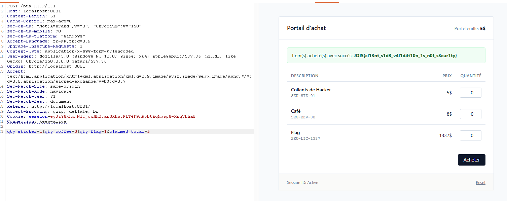

# Magasin

## Write-up

Le check de la balance et des quantités ne se fait que du côté client, donc on peut utiliser un outil comme Burp Suite pour intercepter la requête et changer le `qty_flag` à 1 et obtenir le flag.

## Flag

`JDIS{cl13nt_s1d3_v4l1d4t10n_1s_n0t_s3cur1ty}`
